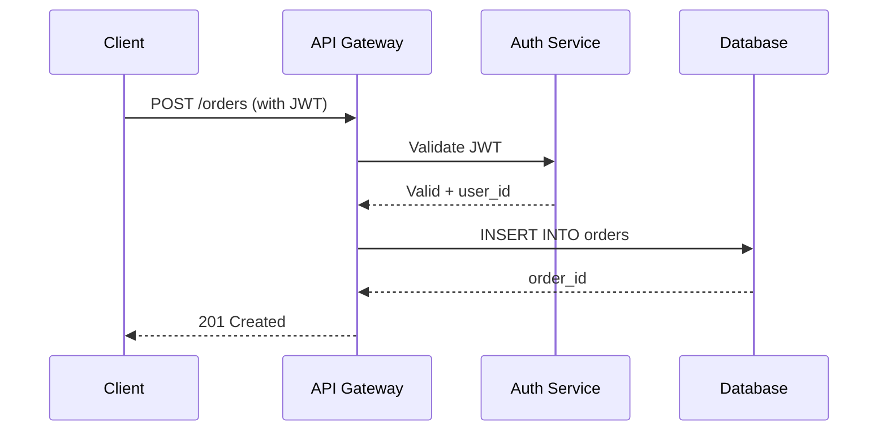
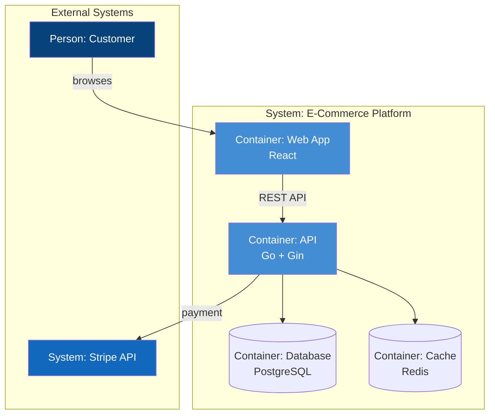

# Architecture Diagram

Generate professional architecture diagrams as renderable text-to-diagram code,
never ASCII art. This skill covers tool selection, the C4 model notation,
layered generation workflow, and syntax validation.

## Why text-to-diagram, not ASCII art

ASCII art diagrams cannot render into graphics, break across font widths, are
nearly impossible to maintain, and look unprofessional in design documents.
Text-to-diagram tools (Mermaid, D2, PlantUML) produce source code that platforms
render into clean SVG/PNG automatically. Since LLMs generate text reliably, this
is the natural fit — the model writes diagram source code, the platform renders
it.

## Tool selection

Choose the tool based on **where the document will be rendered** and **what
level of architectural semantics you need**.

### Decision tree

1. **Is the document on GitHub, GitLab, or Notion?** → Use **Mermaid**. It is
   the only tool natively rendered in GitHub Markdown. GitLab and Notion also
   render Mermaid inline. All other tools require a render step (Kroki or CI).

2. **Do you need formal C4 model semantics** (Context/Container/Component
   layers with typed relationships)? → Use **C4-PlantUML** via Kroki for
   rendering. C4-PlantUML (⭐7,360) is the community-standard C4 implementation.
   Do NOT use Mermaid's native C4 syntax — it is explicitly experimental with
   unstable syntax and missing features.

3. **Is visual polish the top priority** (executive summary, presentation)? →
   Use **D2** with ELK layout engine. Best auto-layout and themes of any tool,
   but requires a render step (Kroki or `d2` CLI).

4. **Do you need one model → many diagrams** (full system documentation)? → Use
   **Structurizr DSL**. Write the model once, derive all C4 views. This
   eliminates consistency drift when generating multiple diagrams.

5. **Multiple tools in one pipeline?** → Use **Kroki** as the unified rendering
   API. Supports 20+ diagram languages behind one HTTP endpoint.

### Quick reference

| Tool | Render on GitHub | C4 support | Visual quality | LLM reliability |
|------|-----------------|------------|----------------|-----------------|
| Mermaid | Native | Experimental (avoid) | Good | Excellent |
| C4-PlantUML | Needs Kroki | Full (⭐7,360) | Dated but rigorous | Good |
| D2 | Needs Kroki | None (hand-roll) | Best | Moderate |
| Structurizr | Needs Kroki | Reference impl | Clean | Moderate |
| Graphviz | Needs Kroki | None | Functional | Good |
| Excalidraw | No | None | Hand-drawn | Poor (JSON coords) |

## The C4 model

When documenting architecture, use the **C4 model** as your notation. C4
provides four zoom levels — think of them as Google Maps zoom for architecture:

1. **System Context** — the system under focus + users + external systems.
   Everyone can understand this. Start here.
2. **Container** — the deployable units (apps, databases, queues, APIs) inside
   the system. This is the core architecture diagram for design docs.
3. **Component** — the internal modules/components of a single container. Use
   for detailed design.
4. **Code** — class-level. Almost never hand-drawn; generate from code.

For most design documents, generate **Context + Container** at minimum. Add
Component diagrams for containers with complex internals.

### C4 vocabulary (use these exact terms)

- `Person` — a user (human) interacting with the system
- `System` / `System_Ext` — the system under focus / an external system
- `Container` — a deployable unit (web app, API, database, message queue)
- `ContainerDb` — a database container
- `Boundary` — a grouping boundary (system boundary, deployment boundary)
- `Rel` — a relationship with description and technology

## Generation workflow

### Step 1: Enumerate entities first

Before writing diagram code, list all entities (systems, containers, components)
with their names, descriptions, and technologies. This two-phase approach
(entities first, relationships second) produces cleaner diagrams than generating
everything at once, because the model can focus on structure before worrying
about edge routing.

### Step 2: Generate diagrams top-down by C4 level

Generate Context first, then Container, then Component. Each level zooms into
the previous one. This matches how readers consume architecture — broad context
first, details later. It also keeps each diagram small enough that the LLM
maintains coherence (over ~20 nodes, diagram quality drops sharply).

### Step 3: Structure before style

Emit structure only first — no theme, color, or style directives. Verify the
structure renders. Then add styling in a second pass. Styling tokens
(`classDef`, `skinparam`, `style`) are where most syntax errors concentrate, so
isolating them makes debugging easier.

### Step 4: Validate syntax

Before delivering, validate the diagram syntax. See the validation section below.

## Mermaid templates

### Flowchart (general architecture — most common)

````markdown
```mermaid
flowchart TB
    Client["Web Client<br/>React SPA"] -->|HTTPS| GW["API Gateway<br/>Kong"]
    GW --> AuthSvc["Auth Service<br/>Go"]
    GW --> OrderSvc["Order Service<br/>Java"]
    AuthSvc --> AuthDB[("Auth DB<br/>PostgreSQL")]
    OrderSvc --> OrderDB[("Order DB<br/>PostgreSQL")]
    OrderSvc -.->|events| Kafka{{"Kafka"}}
    Kafka --> Worker["Async Worker<br/>Python"}

    classDef svc fill:#4A90E2,color:#fff,stroke:#2C5F8D
    classDef db fill:#9B59B6,color:#fff,stroke:#6C3483
    classDef queue fill:#E67E22,color:#fff,stroke:#BA4A00
    class AuthSvc,OrderSvc,Worker svc
    class AuthDB,OrderDB db
    class Kafka queue
```
````

Key syntax notes:
- `flowchart TB` (top-bottom) or `flowchart LR` (left-right) — choose based on
  shape. Wide graphs use LR, deep chains use TB.
- `[("label")]` = cylinder (database), `{{"label"}}` = hexagon (queue/topic),
  `["label"]` = rounded rectangle (service)
- `-.->` = dashed arrow (async/event), `-->` = solid arrow (sync)
- `classDef` + `class` for color-coding by layer (service/db/queue)

### Sequence diagram (interaction flows)

````markdown

````

### C4-style diagram in Mermaid (stable approach)

Since Mermaid's native C4 is experimental, simulate C4 with styled flowcharts:

````markdown

````

## C4-PlantUML templates

When you need formal C4 semantics and can use Kroki for rendering:

````markdown
```plantuml
@startuml
!include https://raw.githubusercontent.com/plantuml-stdlib/C4-PlantUML/master/C4_Container.puml

LAYOUT_WITH_LEGEND()

Person(user, "Customer", "A person who buys products")
System_Ext(stripe, "Stripe", "Payment processing")

System_Boundary(platform, "E-Commerce Platform") {
    Container(webapp, "Web App", "React", "Provides the UI")
    Container(api, "API", "Go + Gin", "Handles business logic")
    ContainerDb(db, "Database", "PostgreSQL", "Stores orders")
    Container(cache, "Cache", "Redis", "Session cache")
}

Rel(user, webapp, "Uses")
Rel(webapp, api, "Makes API calls", "HTTPS/JSON")
Rel(api, db, "Reads/writes", "SQL")
Rel(api, cache, "Reads/writes", "Redis protocol")
Rel(api, stripe, "Processes payments", "HTTPS")

@enduml
```
````

For Kroki rendering, use the URL pattern:
`https://kroki.io/plantuml/svg/<base64-encoded-source>`

## D2 templates

When visual quality is the priority:

````markdown
```d2
direction: down

Customer: {shape: person}
Stripe: Payment Processing {shape: cloud}

E-Commerce Platform: {
  Web App: React
  API: Go + Gin
  Database: PostgreSQL {shape: cylinder}
  Cache: Redis {shape: cylinder}
}

Customer -> Web App: browses
Web App -> API: HTTPS/JSON
API -> Database: SQL
API -> Cache: Redis protocol
API -> Stripe: HTTPS

Customer.style.fill: "#08427B"
Web App.style.fill: "#438DD5"
API.style.fill: "#438DD5"
```
````

## Validation checklist

Before delivering any diagram, run through this checklist:

### Syntax checks

1. **Fenced code block** — diagram code is inside a fenced block with the
   language tag (```` ```mermaid ````, ```` ```plantuml ````, ```` ```d2 ````).
   Without the tag, platforms won't render it.
2. **Mermaid direction keyword** — `flowchart` must include a direction: `TB`,
   `LR`, `BT`, `RL`. Missing direction is a common syntax error.
3. **Quoted labels with special characters** — any label containing `()`,
   `[]`, `{}`, `|`, `<`, `>`, `#`, `&`, or `"` must be wrapped in `["..."]` or
   `["...<br/>..."]`. Unquoted special characters cause parse failures.
4. **PlantUML boundaries** — `@startuml` and `@enduml` must be present.
5. **D2 shape syntax** — shapes use `{shape: cylinder}` not `shape=cylinder`
   (that's the old syntax).
6. **No trailing whitespace** in diagram code — some renderers are sensitive.

### Content checks

7. **Every node has a meaningful label** — not just `A`, `B`, `C`. Include
   technology in the label (e.g., `"Auth Service<br/>Go"`).
8. **Every edge has a label** describing what flows (e.g., `-->|HTTPS|` or
   `Rel(user, webapp, "Uses")`).
9. **Color-coding by layer** — services, databases, queues, external systems
   each get a distinct color. This is what makes a diagram readable at a glance.
10. **Diagram size ≤ 20 nodes** — if more, split into subgraphs or separate
    diagrams per bounded context.

### Optional MCP validation

If the `mcp-mermaid-validator` or `mermaid-mcp-server` is available in the
environment, call it to validate the diagram before delivering. If no MCP is
available, the self-check above is sufficient.

## Common pitfalls

| Pitfall | Why it happens | Fix |
|---------|---------------|-----|
| Mermaid C4 syntax breaks | Mermaid C4 is experimental | Use C4-PlantUML or styled flowchart |
| GitHub doesn't render the diagram | Only Mermaid is native on GitHub | Switch to Mermaid, or pre-render SVG via Kroki |
| GitLab Mermaid version lag | GitLab.com pins Mermaid v10 | Test syntax against Mermaid v10 features |
| Cross-tool syntax confusion | LLM mixes PlantUML macros into Mermaid | Constrain to one tool per diagram |
| Unreadable layout on large graphs | Auto-layout degrades past ~20 nodes | Split into subgraphs or separate diagrams |
| Database shape missing | Wrong bracket syntax | Use `[("label")]` for cylinder in Mermaid |
| Special characters break parse | Unquoted `()`, `[]`, `{}` in labels | Wrap labels in `["..."]` |

## Platform rendering reference

| Platform | Mermaid | PlantUML | D2 | Kroki |
|----------|---------|----------|-----|-------|
| GitHub | Native | No | No | No |
| GitLab | Native (v10) | Yes (admin enable) | No | Yes (admin enable) |
| Notion | `/mermaid` | Embed | Embed | Embed |
| Confluence | Plugin | Plugin | Embed | Embed |
| VS Code | Extension | Extension | Extension | — |

When the target platform doesn't natively render the chosen tool, use Kroki to
pre-render an SVG and embed it as an image alongside the source code:

```markdown

```

This way the diagram renders as an image, and the source is still available
in the code block for editing.
